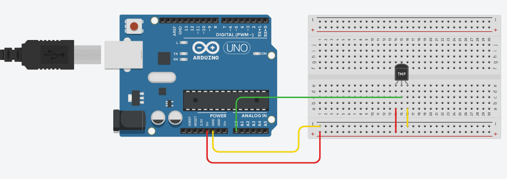

#Sensor LM35 Para Arduino

Esta es una librería escrita en C++ que puedes utilizar para realizar lecturas de temperatura utilizando un componente LM35.

Es una librería que fue creada para que su uso sea los mas fácil posible.

Para utilizarlo primero debes de agregar la referencia de la libreria.
```cpp
#include <lm35.h>
```

Luego debes declarar una variable y debes de pasar como parámetro el pin, en este caso es A0

```cpp
lm35 LM35(0);
```
Luego solo debes de llamar el método toCelsius() y listo
```cpp
Serial.println(String(LM35.toCelsius())+"Grados Celsius\n");
```
Así queda el código completo

```cpp
#include <lm35.h>
//Se llama a la librería y se le pasa como variable el pin de entrada del sensor en este caso A0
lm35 LM35(0);
void setup() {
// Configuramos el puerto serial a 9600 bps
Serial.begin(9600);
}

void loop() {
//Se envia el dato
Serial.println(String(LM35.toCelsius())+"Grados Celsius\n");
// Esperamos un tiempo para repetir el loop
delay(1000);
}
```

la conexión quedaría de la siguiente forma




